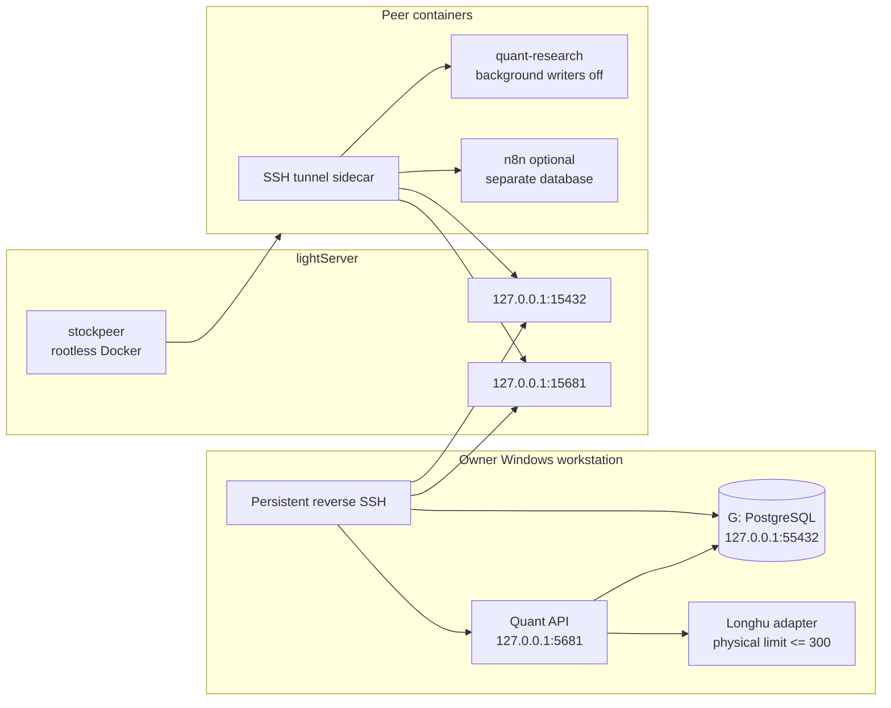

# Shared peer runtime

This deployment keeps the authoritative trading database on the owner's
`G:\StockPlatform` disk while allowing one reviewed collaborator to run the
same research code in an isolated Docker environment. It does not expose a
broker trading path and it does not copy the LonghuVIP upstream credential.

The Windows production code is an immutable release under
`G:\StockPlatform\releases`; `G:\StockPlatform\current` is the only path used by
the production scheduled tasks. Development remains in
`F:\AIWorkflow\trading_hareness`. See `AGENT_HANDOFF.md` for publishing,
rollback and agent takeover.

The complete peer-facing stock-data contract, including all documented
actions and automatic 300-record physical batching, is in
[`SHARED_STOCK_DATA_API.md`](SHARED_STOCK_DATA_API.md).

## Topology



The lightServer listeners are loopback-only. The collaborator gets full
control of the `stockpeer` rootless Docker daemon, not root access and not the
host's rootful Docker socket. A container escape therefore does not grant
lightServer root privileges.

## Ownership and writer policy

- `G:\StockPlatform\data\postgresql16` is the only authoritative quant store.
- The owner's local collector is the only scheduled market-data writer by
  default. `PEER_BACKGROUND_TASKS_ENABLED=false` prevents duplicate scans.
- **The peer is a read-only database principal.** `stock_peer` is `REVOKE`d
  from the application role (`quant_app`) and set `NOINHERIT NOCREATEDB
  NOCREATEROLE` with a connection limit, then explicitly re-granted only
  `CONNECT`/`USAGE`/`SELECT` on the `quant` and `public` schemas (with
  matching `ALTER DEFAULT PRIVILEGES`); the `quant` database session itself
  is set `default_transaction_read_only=on` for that role, with a bounded
  `statement_timeout`/`idle_in_transaction_session_timeout`. Peer credentials
  can still open a session and run ad hoc `SELECT`s for research, but cannot
  `INSERT`/`UPDATE`/`DELETE` into `quant`, and cannot run a schema migration
  against it — **migrations against the authoritative `quant` database are
  owner-only**, run from the owner's Windows workstation through the normal
  `alembic upgrade head` / release-publish path, never from a peer session.
  The peer's own `trading_hareness_peer_n8n` database is unaffected by this
  and remains writable by the peer, since it is not the authoritative quant
  store.
- **Peer startup does not write to the provider control plane.** The peer's
  `quant-research` service is started with
  `QUANT_CONTROL_PLANE_WRITES_ENABLED=false` in
  `deploy/shared-peer/compose.yaml`, on top of
  `PEER_BACKGROUND_TASKS_ENABLED=false` above — the intent is that neither
  scheduled background scans nor an explicit request from the peer container
  can open a provider write path at all. (As of this writing `main.py` does
  not yet read that variable to enforce it; see the work-package report that
  edits `main.py` next for the exact wiring. Until that lands, the read-only
  database grants above are the real backstop, not this application-level
  switch.)
- Database access can be revoked immediately by disabling the `stock_peer`
  role or removing the peer's SSH key — see "Revocation" below.
- Peer credentials are long-lived static credentials: the SSH key, database
  password, shared read/write API keys, and n8n encryption key have no scheduled
  rotation or automatic expiry. Rotate them only after suspected disclosure,
  an owner-requested revocation, or an explicit maintenance event. Plaintext
  values belong in the owner's private handoff bundle outside the checkout and
  must never be committed to Git.
- Peer n8n state uses `trading_hareness_peer_n8n`. Two independently managed
  n8n instances must not share one n8n application schema.
- Full Longhu reads go through `/licensed/stock-api/call` with a dedicated read
  key; `/licensed/longhu/*` remains only as a normalized compatibility view.
  Neither route limits logical quote totals: both split physical upstream calls
  at 300 and combine or return every page. The upstream token and device
  identity stay on the owner's machine.
- List endpoints cap each physical vendor page at 300 and paginate larger
  logical reads in the adapter. Explicit quote baskets are independently
  bounded by `QUANT_LONGHU_INTRADAY_MAX_SYMBOLS`.
- The lightServer `authorized_keys` entries for both the peer (`stockpeer`)
  and the owner's reverse-tunnel account carry `restrict,port-forwarding`
  plus explicit `permitopen`/`permitlisten` clauses scoped to the exact
  loopback ports each side needs (`15432`/`15681`/`15682`), instead of an
  unrestricted key. The owner's tunnel scripts prefer a dedicated,
  restricted `stockowner` account over a general-purpose SSH alias when one
  is configured — see "Owner bootstrap" below.

## Owner bootstrap

Run from an elevated PowerShell only for the one-time server account setup:

```powershell
cd F:\AIWorkflow\trading_hareness
pwsh .\scripts\shared-peer\bootstrap-local-peer.ps1
```

This creates/updates the PostgreSQL `stock_peer` role, a separate peer n8n
database, `G:\StockPlatform\peer\secrets\peer.env`, and the local shared-read
key. It prints paths and status, never secret values.

**This script must be re-run** after the 2026-09 hardening change that
downgraded `stock_peer` to read-only (see "Ownership and writer policy"
above) if the role already existed from before that change — a role created
under the old, fully-privileged script is not retroactively narrowed until
`bootstrap-local-peer.ps1` runs again. After re-running it, verify as
`stock_peer` against the `quant` database:

```sql
SELECT * FROM <any quant-schema table> LIMIT 1;   -- must succeed (read-only grant)
INSERT INTO <any quant-schema table> ...;         -- must fail with permission denied
```

and, connected to the peer's own n8n database
(`trading_hareness_peer_n8n`), confirm a normal n8n write (e.g. a workflow
execution) still succeeds — the role is only read-only against `quant`, not
globally.

Create a dedicated SSH key under `G:\StockPlatform\peer\secrets`, copy only
the public key to lightServer, then provision the non-sudo account:

```powershell
pwsh .\scripts\shared-peer\new-peer-ssh-key.ps1
scp -P 3535 .\scripts\shared-peer\provision-lightserver-rootless.sh lightServer1:/root/
scp -P 3535 G:\StockPlatform\peer\secrets\stockpeer_ed25519.pub lightServer1:/root/
ssh lightServer1 "AUTHORIZED_KEY_FILE=/root/stockpeer_ed25519.pub bash /root/provision-lightserver-rootless.sh"
pwsh .\scripts\shared-peer\install-shared-tunnel-task.ps1
```

**Existing `authorized_keys` entries on lightServer must be updated to the
restricted form** (see "Ownership and writer policy" above): re-running
`provision-lightserver-rootless.sh` with `AUTHORIZED_KEY_FILE` set
regenerates the peer's entry with the `restrict,port-forwarding,permitopen=...`
prefix automatically; an existing unrestricted entry does not update itself.

Generate and install a dedicated, restricted owner-tunnel key instead of
continuing to use a general-purpose SSH alias (e.g. `lightServer1`, which may
be a root-capable alias). On lightServer, as root:

```bash
ssh-keygen -t ed25519 -f owner_tunnel_ed25519
OWNER_TUNNEL_PUBLIC_KEY_FILE=/path/to/owner_tunnel_ed25519.pub \
  bash scripts/shared-peer/install-owner-tunnel-key.sh
```

This provisions a dedicated `stockowner` account (default) with an
`authorized_keys` entry restricted to
`restrict,port-forwarding,permitlisten="127.0.0.1:15432",permitlisten="127.0.0.1:15680",permitlisten="127.0.0.1:15681"`.
Copy the resulting private key to the Windows workstation (for example
`G:\StockPlatform\peer\secrets\owner_tunnel_ed25519`) and add these four keys
to `G:\StockPlatform\config\runtime.env`:

```dotenv
OWNER_TUNNEL_SSH_USER=stockowner
OWNER_TUNNEL_SSH_KEY=G:\StockPlatform\peer\secrets\owner_tunnel_ed25519
OWNER_TUNNEL_SSH_HOST=<lightServer host or IP>
OWNER_TUNNEL_SSH_PORT=<lightServer sshd port>
```

`start-shared-tunnels.ps1`, `start-stock-dashboard.ps1` and
`verify-shared-runtime.ps1` all resolve the SSH target through
`Resolve-OwnerTunnelSshTarget` (`scripts/windows/runtime-observability.psm1`):
when all four variables are set they use this restricted key; when any is
missing they fall back to the pre-existing `$SshAlias` (the `lightServer1`
alias) with a `Write-Warning`, so leaving this unconfigured does not break an
existing deployment — it just does not get the security benefit of this
change.

> **Do not enable the four variables yet.** Setting them was tried on the live
> platform on 2026-09-03 and had to be reverted. Only `start-shared-tunnels.ps1`
> uses the target purely for `-R` port forwarding. `start-stock-dashboard.ps1`
> also *runs remote commands* through the same target (`curl` for the remote
> dashboard health check, `ss` to test the remote listener, `fuser -k` to clear
> a stale one), and `verify-shared-runtime.ps1` runs `ss` plus the
> `verify-complete-stock-api.py` acceptance probe the same way. The account this
> installer creates has `--shell /usr/sbin/nologin`, so every one of those
> commands fails with `This account is currently not available`; the dashboard
> watchdog then loops on `Failed to request cleanup of stale remote listener
> 15680` and the reverse dashboard tunnel never starts. The provisioned account
> and key are harmless while the variables stay unset.
>
> Making the restricted key usable needs one of:
>
> 1. give `stockowner` a real shell and make the acceptance probe readable by it
>    (it currently lives under `/home/stockpeer`), keeping `restrict` +
>    `permitlisten` so only the three ports can be forwarded; or
> 2. add a second `authorized_keys` entry with a forced `command=` wrapper that
>    exposes only the health/listener checks, and teach
>    `Resolve-OwnerTunnelSshTarget` to hand out a separate target for remote
>    execution; or
> 3. stop shelling out entirely — check remote dashboard health through the
>    forwarded port instead of over SSH.

The scheduled tunnel task runs hidden and publishes the owner database and
owner API as lightServer loopback ports. The peer API is a third loopback-only
listener created by rootless Compose. Verify all three with:

```powershell
ssh lightServer1 "ss -lnt | grep -E '127.0.0.1:(15432|15681|15682)'"
```

## Peer deployment

Clone the owner's fork as `stockpeer`, check out the reviewed branch, and copy
`deploy/shared-peer/.env.example` to `.env`. Fill it from the separately
delivered `peer.env`; do not commit it. The tunnel key must be owned by
`stockpeer` and mode `0600`. If the environment bundle was copied from Windows,
normalize it before sourcing it: `sed -i 's/\r$//' deploy/shared-peer/.env`.
Release activation performs this normalization automatically.

The peer image is built from a verified Linux wheelhouse so a slow or blocked
PyPI route cannot make deployment non-reproducible. On the owner workstation:

```powershell
pwsh .\scripts\shared-peer\build-peer-wheelhouse.ps1
scp -P 3535 -r G:\StockPlatform\peer\staging\wheelhouse stockpeer@<lightServer>:/home/stockpeer/
```

Before starting Compose, configure the sidecar's self-SSH path once. This key
can log in only as `stockpeer`; it cannot access root or the host rootful Docker
daemon:

```bash
cd /home/stockpeer/trading_hareness
./scripts/shared-peer/configure-peer-self-tunnel.sh <lightServer-host-or-ip> 3535
```

Set `PEER_SSH_KEY_PATH=/home/stockpeer/.ssh/peer_tunnel_ed25519` and
`PEER_KNOWN_HOSTS_PATH=/home/stockpeer/.ssh/known_hosts` in the peer `.env`.

For an owner-driven immutable release, package the reviewed worktree and
wheelhouse, copy both archives to lightServer, then run
`scripts/shared-peer/activate-peer-release.sh <repo-archive> <wheelhouse-archive>`
as root. It validates both tar archives and every wheel SHA-256 before
atomically switching `/home/stockpeer/trading_hareness` and
`/home/stockpeer/wheelhouse` symlinks. A failed validation leaves the active
release unchanged.

```bash
export XDG_RUNTIME_DIR=/run/user/$(id -u)
export DOCKER_HOST=unix://${XDG_RUNTIME_DIR}/docker.sock
docker compose --env-file .env -f deploy/shared-peer/compose.yaml config --quiet
docker compose --env-file .env -f deploy/shared-peer/compose.yaml up -d --build db-tunnel quant-research
docker compose --env-file .env -f deploy/shared-peer/compose.yaml ps
curl -fsS http://127.0.0.1:15682/health
```

Enable peer n8n only if it is needed:

```bash
docker compose --env-file .env -f deploy/shared-peer/compose.yaml --profile n8n up -d n8n
```

## Data migration

Migration is candidate-first. The current G-drive database is never overwritten
by the restore command.

On the friend's current host:

```bash
cd trading_hareness
PGHOST=... PGPORT=... PGDATABASE=... PGUSER=... PGPASSWORD=... \
  ./scripts/shared-peer/export-peer-data.sh /secure/export/path
```

The default `application.dump` contains both application schemas: `public`
(ingestion and relay records) and `quant`. Both are required because quant
research rows have foreign keys to public ingestion jobs. Set
`EXPORT_N8N_PUBLIC_SCHEMA=true` and `N8N_PGDATABASE=...` only when the separate
n8n database is also being migrated; that dump can contain encrypted
credentials and must be transported privately.

After copying `application.dump` and `application.dump.sha256` to the owner
workstation:

```powershell
pwsh .\scripts\shared-peer\prepare-peer-candidate.ps1 `
  -QuantDump G:\StockPlatform\peer\imports\<stamp>\application.dump
```

The preparation step verifies the checksum and archive, restores into
`trading_hareness_candidate`, upgrades it to the repository's Alembic head,
reimports durable stock-brain facts, and prints table/instrument counts. The
production database remains untouched.

After comparing the candidate and running API acceptance against it, stop the
local API and explicitly promote:

```powershell
pwsh .\scripts\shared-peer\promote-peer-candidate.ps1 -Promote -Confirm
pwsh .\scripts\windows\start-stock-platform.ps1
```

Promotion renames the old production database to a timestamped
`trading_hareness_rollback_*` database and then renames the candidate. The
runtime configuration does not change. Rollback is the inverse pair of
database renames while the API is stopped.

## Acceptance and failure isolation

Owner-side acceptance:

```powershell
pwsh .\scripts\shared-peer\verify-shared-runtime.ps1
```

## Windows runtime observability

The owner API, dashboard adapter, dashboard reverse tunnel, and shared peer
tunnels are started through a
small process supervisor. Every launch gets a unique run ID and separate
stdout/stderr files, so a restart never truncates the evidence from the prior
run. The supervisor waits for the child and records its exit code. A stop marker
distinguishes an operator-requested stop from an unexpected exit.

Runtime evidence lives outside Git under:

```text
G:\StockPlatform\logs\runtime\
  lifecycle-YYYY-MM-DD.jsonl
  quant-api.current.json
  dashboard-adapter.current.json
  dashboard-tunnel.current.json
  services\<service>\YYYY-MM-DD\<run-id>.stdout.log
  services\<service>\YYYY-MM-DD\<run-id>.stderr.log
  services\<service>\YYYY-MM-DD\<run-id>.run.json
```

Use the bounded, secret-free diagnostic view before reading raw logs:

```powershell
pwsh .\scripts\windows\get-stock-runtime-status.ps1
```

Its state distinguishes `healthy`, `stopped`, `unexpected_exit`, and
`supervisor_failed`, includes the actual supervisor/launcher/listener PIDs, and
returns the latest lifecycle events. Service logs are retained for 30 days and
lifecycle events for 90 days by the watchdog. The legacy
`dashboard-watchdog.log` remains an append-only human-readable fallback; it is
not the authoritative diagnostic record.

It requires all of these to be true:

1. the G-drive database answers with its Alembic revision;
2. the local API is healthy;
3. an authenticated Longhu quote returns exactly one requested row;
4. the database, owner API, and peer API loopback ports exist on lightServer;
5. the remote owner API at `15681` returns HTTP 200, not merely an open port;
6. the remote peer API at `15682` returns HTTP 200;
7. the complete stock gateway probe passes authentication, catalog, quote,
   breadth, public-source, and 300+1 batching checks.

The Windows dashboard runtime task also supervises the owner API every 30
seconds. It identifies the service from the actual listening PID and command
line rather than trusting a stale PID file. Reinstall or refresh that task with:

```powershell
pwsh .\scripts\windows\install-stock-dashboard-task.ps1
```

Failure behavior is deliberate:

- If the Windows tunnel stops, peer services become unavailable but the local
  API/database continue unchanged.
- If peer containers fail, they cannot stop or rename the local database.
- If Longhu fails, intraday capture records the licensed-source failure and
  uses the existing Tencent/Sina fallback; it must not relabel fallback data as
  Longhu.
- If migration validation fails, do not promote. Delete/recreate only the
  candidate database and retain production.

## Revocation

Disable database access immediately:

```sql
ALTER ROLE stock_peer NOLOGIN;
```

Then remove the collaborator's public key from
`/home/stockpeer/.ssh/authorized_keys` and stop the rootless Compose project.
No local market service restart is required to revoke the peer.
