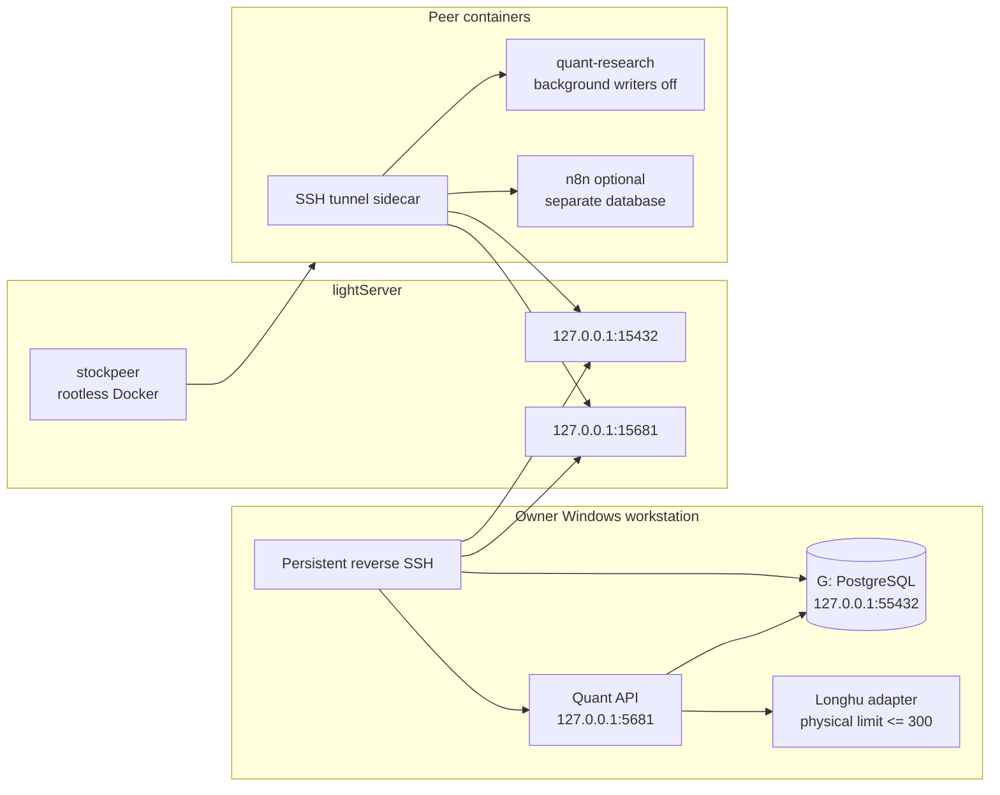

# Shared peer runtime

Current lightServer incident/deployment addendum: [PEER_POOL_RECOVERY_20260914.md](PEER_POOL_RECOVERY_20260914.md).
The later same-host routing fix and repeated load/outage acceptance are in
[PEER_PRIVATE_TUNNEL_20260914.md](PEER_PRIVATE_TUNNEL_20260914.md).
It records the two active writer profiles, immutable hotfix, outage acceptance and rollback;
the generic research-only topology below is not the complete live deployment inventory.

This deployment keeps the authoritative trading database on the owner's
`G:\StockPlatform` disk while allowing one reviewed collaborator to run the
same research code in an isolated Docker environment. It does not expose a
broker trading path and it does not copy the LonghuVIP upstream credential.

The Windows production code is an immutable release under
`G:\StockPlatform\releases`; `G:\StockPlatform\current` is the only path used by
the production scheduled tasks. Development remains in
`F:\AIWorkflow\trading_hareness`. See `AGENT_HANDOFF.md` for publishing,
rollback and agent takeover.

The complete peer-facing stock-data contract, including all documented
actions and automatic 300-record physical batching, is in
[`SHARED_STOCK_DATA_API.md`](SHARED_STOCK_DATA_API.md).

## Topology



The lightServer listeners are loopback-only. The collaborator gets full
control of the `stockpeer` rootless Docker daemon, not root access and not the
host's rootful Docker socket. A container escape therefore does not grant
lightServer root privileges.

## How the peer actually reaches the database

The authoritative store has no network listener at all, yet a container on a
cloud host 1,000 km away reads and writes it. Both statements are true, and
the reason is worth stating explicitly because it decides where the security
boundary really is.

The database is a portable PostgreSQL 16.15 under the platform root — not a
system install, not a Windows service, not in `PATH`:

```text
G:\StockPlatform\runtime\postgresql-16.15\bin\postgres.exe -D G:\StockPlatform\data\postgresql16
G:\StockPlatform\data\postgresql16     3.8 GB   (pg_wal 1.7 GB, same spindle, no separate tablespace)
G:\StockPlatform\config\postgresql-stock-platform.conf
```

`G:` is the workstation's only mechanical disk (HGST `HUH721212ALE601`, 10.9 TB,
`MediaType = HDD`); the machine's other four volumes are SSD. Nothing starts the
server at boot: `start-stock-dashboard.ps1` probes it with `pg_isready` and, if
needed, runs `pg_ctl start`, and that script is driven by the 30-second watchdog
loop. **The watchdog is the service manager for this deployment** — see
"Windows runtime observability".

Its exposure is closed:

```text
listen_addresses = '127.0.0.1'
port             = 55432
pg_hba.conf      local + 127.0.0.1/32 + ::1/128, scram-sha-256   (no network rule at all)
```

The reverse tunnel does not bypass `pg_hba`; it manufactures a loopback
connection. The owner's machine dials **out** and asks the far end to publish a
loopback listener that flows back down the same connection:

```text
ssh -NT -o ExitOnForwardFailure=yes -o ServerAliveInterval=30 \
    -R 127.0.0.1:15432:127.0.0.1:55432 \
    -R 127.0.0.1:15681:127.0.0.1:5681  lightServer1
```

Five hops, end to end:

```text
1. peer app container      PGHOST=db-tunnel PGPORT=5432 PGUSER=stock_peer
        v  container network
2. db-tunnel sidecar       ssh -L 0.0.0.0:5432:127.0.0.1:15432 stockpeer@<host> -p 3535
        v  (it SSHes back into lightServer itself, purely to pull a host-loopback
           port into the Docker network so sibling containers can address it)
3. lightServer             127.0.0.1:15432   (held by sshd, loopback-only)
        v  reverse tunnel, dialled outbound by the owner
4. owner workstation       127.0.0.1:55432
        v
5. postgres.exe -D G:\StockPlatform\data\postgresql16
```

From the server's point of view every peer session is a local connection from
`127.0.0.1`, which is why the second `pg_hba` line admits it. Three consequences
follow, and they are the ones that matter operationally:

- **The boundary is the two forwarded ports, not the machine list.** The
  collaborator cannot log in to the workstation — the tunnel is outbound and
  nothing listens in the other direction — but for as long as those ports
  exist, the `quant` schema is reachable with the grants described below.
- **There is no replica and no local copy.** lightServer has no PostgreSQL
  binary and no data volume of consequence (`/var/lib/quant` is 0 bytes);
  every peer query traverses the tunnel to the workstation's mechanical disk.
- **The kill switch is unilateral and immediate.** Stopping the
  `trading-hareness-shared-peer-tunnels` task removes `15432`/`15681` within
  seconds. It needs no password change, no key removal, and no access to the
  collaborator's host. Since the batch tunnel was added there is a second task
  to stop as well — see "Revocation".

## The batch tunnel (second connection, 15433)

Everything above describes **one** SSH connection carrying both forwards. That
is exactly the problem the batch tunnel solves, and the reason it had to be a
second connection rather than a third `-R` on the existing one:

SSH multiplexes every forward as a *channel* over a single TCP connection. The
channels share that connection's congestion window and its ordering, so a bulk
job — a `COPY`, a full-table export, a backfill — fills the window and intraday
queries queue behind bytes nobody is waiting on. The peer author measured
**52.5 ms RTT** on this link, so that queueing is not a rounding error. Adding
`-R 15433` to the existing ssh process would have put the bulk traffic on the
same window and changed nothing.

There are therefore two independent owner-side connections, each with its own
scheduled task, supervised runtime service, state file and lock file:

| | intraday | batch |
| --- | --- | --- |
| scheduled task | `trading-hareness-shared-peer-tunnels` | `trading-hareness-shared-peer-batch-tunnel` |
| runtime service | `shared-peer-tunnels` | `shared-peer-batch-tunnel` |
| forwards | `-R 15432:55432`, `-R 15681:5681` | `-R 15433:55432` |
| compression | off | `-o Compression=yes` |
| health claim | remote API HTTP 200 | remote loopback listener on 15433, owned by this install's local ssh client |
| peer address | `db-tunnel:5432` | `db-tunnel:5433` |

Both reach the same database on the same port 55432; only the transport differs.
Compression is on for batch alone because bulk result sets compress well and the
link is latency- rather than CPU-bound, and it is declared as an explicit
`Compression` property on the profile so the recorded runtime metadata reports
what was configured rather than inferring it from "does this profile carry any
ssh option at all".

"Its own TCP connection" is pinned on the command line, not inherited from the
host: both profiles pass `-o ControlMaster=no -o ControlPath=none`. Without them
a single `ControlMaster auto` + `ControlPath` pair in `~/.ssh/config` — a routine
latency tweak on a 52.5 ms link — would make the batch client open a channel on
the intraday client's existing socket, putting bulk traffic straight back into the
window it was moved out of, with nothing failing and nothing to see. This is the
one deliberate change to the intraday ssh argument vector; it is a no-op against
the current host configuration (`ssh -G lightServer1` already reports
`controlmaster false`) and the pinned vector in
`scripts/windows/tests/test-shared-tunnel-profiles.ps1` was updated with it. After
installing both, `install-shared-tunnel-tasks.ps1` reads the TCP connections each
profile's `ssh.exe` owns (`Get-NetTCPConnection -OwningProcess`) and warns —
recording a `tunnel_connection_separation_checked` runtime event — if they are not
disjoint. Apart from those two options the intraday profile is byte-for-byte what
it was, and the test pins its vector literally so a later edit cannot quietly
change the live intraday tunnel.

Install both from the owner side:

```powershell
pwsh .\scripts\shared-peer\install-shared-tunnel-tasks.ps1
```

`install-shared-tunnel-task.ps1 -Profile batch` installs the batch task alone,
and `-WhatIf` on either prints the plan (task name, action, forwards, reclaim
set) while touching no scheduled task, no runtime state and no ssh process.

Two operational consequences worth stating plainly:

- **Batch is optional and must stay optional.** `install-shared-tunnel-tasks.ps1`
  installs intraday first and unguarded; a batch failure is warned about and
  recorded as a `shared-peer-batch-tunnel` `install_failed` event but does not
  fail the caller unless it passed `-RequireBatch`. On the peer side the
  `db-tunnel` healthcheck deliberately still checks only 5432 and 5681 — gating
  container health on an optimization would turn it into an outage.
- **15433 must appear on both sides of the key restrictions.** On the owner side
  it is `permitlisten` in `install-owner-tunnel-key.sh`, which matters if the
  restricted owner-tunnel key is ever enabled (the four `OWNER_TUNNEL_SSH_*`
  keys in `runtime.env`): with `-o ExitOnForwardFailure=yes` a missing
  `permitlisten` is not "slower batch traffic", the ssh process exits within
  seconds and the two-minute supervising trigger retries into the same refusal
  indefinitely. On the peer side it is `permitopen` in
  `provision-lightserver-rootless.sh`, and there the failure is silent instead:
  the sidecar's `-L 5433` is a local bind that always succeeds, so the container
  stays healthy while every connection through it is refused with
  "administratively prohibited: open failed". Neither script rewrites an
  `authorized_keys` entry that already exists. While the four owner keys are
  unset both tunnels fall back to the unrestricted `lightServer1` alias, where
  15433 binds with no extra setup.

On the peer the batch port stays off until `PEER_BATCH_DB_PORT` is set in
`deploy/shared-peer/.env`. `-L` binds locally and does not require the far end
to be listening, so enabling it while the owner batch tunnel is down means
connections to `db-tunnel:5433` fail individually; 5432 and 5681 are unaffected.
`scripts/shared-peer/deploy-batch-tunnel-port.py` performs that peer-side
change: it backs up `.env`/`compose.yaml`/the entrypoint, asserts that no
service other than `db-tunnel` moves, rebuilds and recreates only `db-tunnel`,
then proves the path with an authenticated `SELECT 1, inet_server_port()`
through 5433 — `55432` is the only answer that proves the owner's PostgreSQL
rather than an open socket — and prints its rollback command. It refuses to run
unless the peer's deployed state (entrypoint hash, `db-tunnel` healthcheck,
environment keys, image) matches one of the states it explicitly supports.

The peer rollout itself — what the release scripts must call, what the peer is
actually running today, and the ordered steps — is
[PEER_BATCH_TUNNEL_ROLLOUT.md](PEER_BATCH_TUNNEL_ROLLOUT.md). Read it before
running anything against lightServer.

## Verifying the access path

Do not trust the privilege statements in this file; re-measure them. Effective
grants, from the owner side:

```sql
select has_table_privilege('stock_peer','quant.canonical_bars_daily','SELECT')  as sel,
       has_table_privilege('stock_peer','quant.canonical_bars_daily','INSERT')  as ins,
       has_table_privilege('stock_peer','quant.canonical_bars_daily','UPDATE')  as upd,
       has_table_privilege('stock_peer','quant.canonical_bars_daily','DELETE')  as del,
       has_table_privilege('stock_peer','quant.canonical_bars_daily','TRUNCATE') as trunc;

select rolname, rolinherit, rolconnlimit, rolconfig from pg_roles where rolname = 'stock_peer';
select g.rolname as member_of from pg_auth_members m
  join pg_roles r on r.oid = m.member join pg_roles g on g.oid = m.roleid
 where r.rolname = 'stock_peer';
```

End to end from inside the peer container, which proves the whole chain rather
than the grant alone. The write is rolled back, so it changes nothing:

```bash
docker exec trading-hareness-peer-quant-research-1 python3 -c "
import os, psycopg
c = psycopg.connect(host=os.environ['PGHOST'], port=os.environ['PGPORT'],
                    dbname=os.environ['PGDATABASE'], user=os.environ['PGUSER'],
                    password=os.environ['PGPASSWORD'], connect_timeout=10)
try:
    print(c.execute('select current_database(), current_user, inet_server_port()').fetchone())
    print('read_only =', c.execute('show transaction_read_only').fetchone()[0])
    print('rows =', c.execute(\"update quant.universe_members set updated_at = updated_at \"
                              \"where symbol = (select min(symbol) from quant.universe_members)\").rowcount)
finally:
    c.rollback(); c.close()
"
```

A correct result reports `inet_server_port() = 55432` — the workstation's
PostgreSQL, not anything local to lightServer.

## Ownership and writer policy

- `G:\StockPlatform\data\postgresql16` is the only authoritative quant store.
- The owner's local collector is the only scheduled market-data writer by
  default. `PEER_BACKGROUND_TASKS_ENABLED=false` prevents duplicate scans.
- **The peer is a full read/write principal on `quant`. This is a deliberate
  owner decision, not an oversight.** An earlier revision of this document
  claimed the opposite in bold — that `stock_peer` had been revoked from
  `quant_app`, set `NOINHERIT` with a connection limit, re-granted only
  `SELECT`, and pinned to `default_transaction_read_only=on`. That lockdown
  was designed during the 2026-09 audit but **was never applied**: the owner
  chose to keep the collaborator fully trusted instead. The document was not
  corrected at the time, so for two days it asserted a protection that did
  not exist. Measured against production on 2026-09-05:

  | Documented claim | Measured |
  | --- | --- |
  | revoked from `quant_app` | `stock_peer` **is** a member of `quant_app` |
  | `NOINHERIT` | `rolinherit = t` |
  | connection limit | `rolconnlimit = -1` |
  | `SELECT` only | `SELECT/INSERT/UPDATE/DELETE/TRUNCATE` all true |
  | `default_transaction_read_only=on` | `rolconfig` empty; session reports `off` |
  | bounded statement/idle timeouts | none set |
  | cannot write to `quant` | `UPDATE` from the peer container affected 1 row |

  Treat every privilege statement in this file as a claim to be re-measured,
  not as a guarantee. The queries that produce the table above are in
  "Verifying the access path" below.

  Schema migrations remain owner-only **by convention, not by permission**:
  they run from the Windows workstation through `alembic upgrade head` and the
  release-publish path. Nothing in the database currently prevents a peer
  session from running one.

  The peer's own `trading_hareness_peer_n8n` database is a separate store and
  is not part of the authoritative `quant` data.
- **`QUANT_CONTROL_PLANE_WRITES_ENABLED=false` is set in
  `deploy/shared-peer/compose.yaml`, but the running peer stack predates it.**
  The deployed container's environment does not carry the variable (verified
  2026-09-05), so provider-capability rows are still rewritten with process
  defaults on every peer restart. Today this is value-neutral — neither side
  configures `TUSHARE_*_REQUESTS_PER_MINUTE`, so both compute the same
  defaults — and it only becomes a real divergence once real rate limits are
  configured on the owner. Recreating the peer stack from the current compose
  closes it. Note also that `main.py` does not yet read the variable, so the
  compose setting is a declaration of intent rather than an enforced control.
- Database access can be revoked immediately by disabling the `stock_peer`
  role or removing the peer's SSH key — see "Revocation" below.
- Peer credentials are long-lived static credentials: the SSH key, database
  password, shared read/write API keys, and n8n encryption key have no scheduled
  rotation or automatic expiry. Rotate them only after suspected disclosure,
  an owner-requested revocation, or an explicit maintenance event. Plaintext
  values belong in the owner's private handoff bundle outside the checkout and
  must never be committed to Git.
- Peer n8n state uses `trading_hareness_peer_n8n`. Two independently managed
  n8n instances must not share one n8n application schema.
- Full Longhu reads go through `/licensed/stock-api/call` with a dedicated read
  key; `/licensed/longhu/*` remains only as a normalized compatibility view.
  Neither route limits logical quote totals: both split physical upstream calls
  at 300 and combine or return every page. The upstream token and device
  identity stay on the owner's machine.
- List endpoints cap each physical vendor page at 300 and paginate larger
  logical reads in the adapter. Explicit quote baskets are independently
  bounded by `QUANT_LONGHU_INTRADAY_MAX_SYMBOLS`.
- **The `stockpeer` keys are unrestricted, and `stockpeer` has a login
  shell.** An earlier revision claimed both peer and owner keys carried
  `restrict,port-forwarding` with `permitopen`/`permitlisten` scoped to
  `15432`/`15681`/`15682`. Measured 2026-09-05: all four keys in
  `/home/stockpeer/.ssh/authorized_keys` carry **no options at all**, and
  `stockpeer` is `/bin/bash`, not `nologin`. Because `stockpeer` is UID 1002
  and owns `/run/user/1002/docker.sock`, an interactive login there is full
  control of the rootless Docker daemon — including `docker inspect`, which
  exposes the database password and the shared read key held in the peer
  container's environment. This follows from the same "fully trusted
  collaborator" decision as the database grants above.

  One of those keys (`SHA256:BSQJGt3o…`, comment `stockpeer@ultratouf`) has
  authenticated from three distinct addresses — the owner's own workstation
  and two external networks. It is a shared private key, so it cannot be
  revoked for one holder without revoking it for all of them.

  Only the **owner's** `stockowner` key is restricted, and it is currently
  inert: enabling it breaks the dashboard tunnel because the same SSH target
  is used to run remote commands. See the warning under "Owner bootstrap".

## Owner bootstrap

Run from an elevated PowerShell only for the one-time server account setup:

```powershell
cd F:\AIWorkflow\trading_hareness
pwsh .\scripts\shared-peer\bootstrap-local-peer.ps1
```

This creates/updates the PostgreSQL `stock_peer` role, a separate peer n8n
database, `G:\StockPlatform\peer\secrets\peer.env`, and the local shared-read
key. It prints paths and status, never secret values.

**This script must be re-run** after the 2026-09 hardening change that
downgraded `stock_peer` to read-only (see "Ownership and writer policy"
above) if the role already existed from before that change — a role created
under the old, fully-privileged script is not retroactively narrowed until
`bootstrap-local-peer.ps1` runs again. After re-running it, verify as
`stock_peer` against the `quant` database:

```sql
SELECT * FROM <any quant-schema table> LIMIT 1;   -- must succeed (read-only grant)
INSERT INTO <any quant-schema table> ...;         -- must fail with permission denied
```

and, connected to the peer's own n8n database
(`trading_hareness_peer_n8n`), confirm a normal n8n write (e.g. a workflow
execution) still succeeds — the role is only read-only against `quant`, not
globally.

Create a dedicated SSH key under `G:\StockPlatform\peer\secrets`, copy only
the public key to lightServer, then provision the non-sudo account:

```powershell
pwsh .\scripts\shared-peer\new-peer-ssh-key.ps1
scp -P 3535 .\scripts\shared-peer\provision-lightserver-rootless.sh lightServer1:/root/
scp -P 3535 G:\StockPlatform\peer\secrets\stockpeer_ed25519.pub lightServer1:/root/
ssh lightServer1 "AUTHORIZED_KEY_FILE=/root/stockpeer_ed25519.pub bash /root/provision-lightserver-rootless.sh"
pwsh .\scripts\shared-peer\install-shared-tunnel-tasks.ps1
```

`install-shared-tunnel-tasks.ps1` installs both tunnel profiles (intraday and
batch). `install-shared-tunnel-task.ps1` on its own still installs the intraday
task only, which is what it did before the batch profile existed.

**Existing `authorized_keys` entries on lightServer are not updated in place**:
re-running `provision-lightserver-rootless.sh` with `AUTHORIZED_KEY_FILE` set
regenerates the peer's entry with the
`restrict,port-forwarding,permitopen="127.0.0.1:15432",permitopen="127.0.0.1:15433",permitopen="127.0.0.1:15681"`
prefix, but an existing unrestricted entry does not update itself. `permitopen`
now covers the batch database path (15433) as well; an entry provisioned before
that was added keeps the old two-port list, and the sidecar's `-L 5433` forward
then binds successfully while every connection through it is refused with
"administratively prohibited: open failed" - the container stays healthy and the
batch path simply never works.

> This is the procedure for restricting the peer key, not a statement that the
> peer key is restricted. The owner has decided to keep the collaborator fully
> trusted, so the `stockpeer` entries are deliberately left unrestricted — see
> "Ownership and writer policy" above. Do not run this against `stockpeer`
> without confirming that decision has changed.

Generate and install a dedicated, restricted owner-tunnel key instead of
continuing to use a general-purpose SSH alias (e.g. `lightServer1`, which may
be a root-capable alias). On lightServer, as root:

```bash
ssh-keygen -t ed25519 -f owner_tunnel_ed25519
OWNER_TUNNEL_PUBLIC_KEY_FILE=/path/to/owner_tunnel_ed25519.pub \
  bash scripts/shared-peer/install-owner-tunnel-key.sh
```

This provisions a dedicated `stockowner` account (default) with an
`authorized_keys` entry restricted to
`restrict,port-forwarding,permitlisten="127.0.0.1:15432",permitlisten="127.0.0.1:15433",permitlisten="127.0.0.1:15680",permitlisten="127.0.0.1:15681"`
(four ports: owner database, batch database, dashboard, owner API).
Copy the resulting private key to the Windows workstation (for example
`G:\StockPlatform\peer\secrets\owner_tunnel_ed25519`) and add these four keys
to `G:\StockPlatform\config\runtime.env`:

```dotenv
OWNER_TUNNEL_SSH_USER=stockowner
OWNER_TUNNEL_SSH_KEY=G:\StockPlatform\peer\secrets\owner_tunnel_ed25519
OWNER_TUNNEL_SSH_HOST=<lightServer host or IP>
OWNER_TUNNEL_SSH_PORT=<lightServer sshd port>
```

`start-shared-tunnels.ps1`, `start-stock-dashboard.ps1` and
`verify-shared-runtime.ps1` all resolve the SSH target through
`Resolve-OwnerTunnelSshTarget` (`scripts/windows/runtime-observability.psm1`):
when all four variables are set they use this restricted key; when any is
missing they fall back to the pre-existing `$SshAlias` (the `lightServer1`
alias) with a `Write-Warning`, so leaving this unconfigured does not break an
existing deployment — it just does not get the security benefit of this
change.

The forwarding and control identities are deliberately separate. The
long-running `-R` processes use the `stockowner` nologin account and its
`permitlisten`-restricted key. Short-lived listener cleanup and end-to-end
verification commands use the existing operator alias through
`Resolve-OwnerTunnelControlSshTarget`. This keeps the unattended credentials
non-interactive without breaking `ss`, `curl`, `fuser` or the collaborator's
complete gateway probe. The four variables may be enabled after the public-key
fingerprint and all four `permitlisten` entries have been verified.

The scheduled tunnel tasks run hidden and publish the owner database (15432),
the owner API (15681) and, once the batch task is installed, the batch database
path (15433) as lightServer loopback ports. The peer API is a further
loopback-only listener created by rootless Compose. Verify them with:

```powershell
ssh lightServer1 "ss -lnt | grep -E '127.0.0.1:(15432|15433|15681|15682)'"
```

`15433` is absent until `install-shared-tunnel-tasks.ps1` (or
`install-shared-tunnel-task.ps1 -Profile batch`) has run; its absence does not
affect the other three.

## Peer deployment

Clone the owner's fork as `stockpeer`, check out the reviewed branch, and copy
`deploy/shared-peer/.env.example` to `.env`. Fill it from the separately
delivered `peer.env`; do not commit it. The tunnel key must be owned by
`stockpeer` and mode `0600`. If the environment bundle was copied from Windows,
normalize it before sourcing it: `sed -i 's/\r$//' deploy/shared-peer/.env`.
Release activation performs this normalization automatically.

The peer image is built from a verified Linux wheelhouse so a slow or blocked
PyPI route cannot make deployment non-reproducible. On the owner workstation:

```powershell
pwsh .\scripts\shared-peer\build-peer-wheelhouse.ps1
scp -P 3535 -r G:\StockPlatform\peer\staging\wheelhouse stockpeer@<lightServer>:/home/stockpeer/
```

Before starting Compose, configure the sidecar's self-SSH path once. This key
can log in only as `stockpeer`; it cannot access root or the host rootful Docker
daemon:

```bash
cd /home/stockpeer/trading_hareness
./scripts/shared-peer/configure-peer-self-tunnel.sh <lightServer-host-or-ip> 3535
```

Set `PEER_SSH_KEY_PATH=/home/stockpeer/.ssh/peer_tunnel_ed25519` and
`PEER_KNOWN_HOSTS_PATH=/home/stockpeer/.ssh/known_hosts` in the peer `.env`.

For an owner-driven immutable release, package the reviewed worktree and
wheelhouse, copy both archives to lightServer, then run
`scripts/shared-peer/activate-peer-release.sh <repo-archive> <wheelhouse-archive>`
as root. It validates both tar archives and every wheel SHA-256 before
atomically switching `/home/stockpeer/trading_hareness` and
`/home/stockpeer/wheelhouse` symlinks. A failed validation leaves the active
release unchanged.

```bash
export XDG_RUNTIME_DIR=/run/user/$(id -u)
export DOCKER_HOST=unix://${XDG_RUNTIME_DIR}/docker.sock
docker compose --env-file .env -f deploy/shared-peer/compose.yaml config --quiet
docker compose --env-file .env -f deploy/shared-peer/compose.yaml up -d --build db-tunnel quant-research
docker compose --env-file .env -f deploy/shared-peer/compose.yaml ps
curl -fsS http://127.0.0.1:15682/health
```

Enable peer n8n only if it is needed:

```bash
docker compose --env-file .env -f deploy/shared-peer/compose.yaml --profile n8n up -d n8n
```

## Data migration

Migration is candidate-first. The current G-drive database is never overwritten
by the restore command.

On the friend's current host:

```bash
cd trading_hareness
PGHOST=... PGPORT=... PGDATABASE=... PGUSER=... PGPASSWORD=... \
  ./scripts/shared-peer/export-peer-data.sh /secure/export/path
```

The default `application.dump` contains both application schemas: `public`
(ingestion and relay records) and `quant`. Both are required because quant
research rows have foreign keys to public ingestion jobs. Set
`EXPORT_N8N_PUBLIC_SCHEMA=true` and `N8N_PGDATABASE=...` only when the separate
n8n database is also being migrated; that dump can contain encrypted
credentials and must be transported privately.

After copying `application.dump` and `application.dump.sha256` to the owner
workstation:

```powershell
pwsh .\scripts\shared-peer\prepare-peer-candidate.ps1 `
  -QuantDump G:\StockPlatform\peer\imports\<stamp>\application.dump
```

The preparation step verifies the checksum and archive, restores into
`trading_hareness_candidate`, upgrades it to the repository's Alembic head,
reimports durable stock-brain facts, and prints table/instrument counts. The
production database remains untouched.

After comparing the candidate and running API acceptance against it, stop the
local API and explicitly promote:

```powershell
pwsh .\scripts\shared-peer\promote-peer-candidate.ps1 -Promote -Confirm
pwsh .\scripts\windows\start-stock-platform.ps1
```

Promotion renames the old production database to a timestamped
`trading_hareness_rollback_*` database and then renames the candidate. The
runtime configuration does not change. Rollback is the inverse pair of
database renames while the API is stopped.

## Acceptance and failure isolation

Owner-side acceptance:

```powershell
pwsh .\scripts\shared-peer\verify-shared-runtime.ps1
```

## Windows runtime observability

The owner API, dashboard adapter, dashboard reverse tunnel, and shared peer
tunnels are started through a
small process supervisor. Every launch gets a unique run ID and separate
stdout/stderr files, so a restart never truncates the evidence from the prior
run. The supervisor waits for the child and records its exit code. A stop marker
distinguishes an operator-requested stop from an unexpected exit.

Runtime evidence lives outside Git under:

```text
G:\StockPlatform\logs\runtime\
  lifecycle-YYYY-MM-DD.jsonl
  quant-api.current.json
  dashboard-adapter.current.json
  dashboard-tunnel.current.json
  services\<service>\YYYY-MM-DD\<run-id>.stdout.log
  services\<service>\YYYY-MM-DD\<run-id>.stderr.log
  services\<service>\YYYY-MM-DD\<run-id>.run.json
```

Use the bounded, secret-free diagnostic view before reading raw logs:

```powershell
pwsh .\scripts\windows\get-stock-runtime-status.ps1
```

Its state distinguishes `healthy`, `stopped`, `unexpected_exit`, and
`supervisor_failed`, includes the actual supervisor/launcher/listener PIDs, and
returns the latest lifecycle events. Service logs are retained for 30 days and
lifecycle events for 90 days by the watchdog. The legacy
`dashboard-watchdog.log` remains an append-only human-readable fallback; it is
not the authoritative diagnostic record.

It requires all of these to be true:

1. the G-drive database answers with its Alembic revision;
2. the local API is healthy;
3. an authenticated Longhu quote returns exactly one requested row;
4. the database, owner API, and peer API loopback ports exist on lightServer;
5. the remote owner API at `15681` returns HTTP 200, not merely an open port;
6. the remote peer API at `15682` returns HTTP 200;
7. the complete stock gateway probe passes authentication, catalog, quote,
   breadth, public-source, and 300+1 batching checks.

The Windows dashboard runtime task also supervises the owner API every 30
seconds. It identifies the service from the actual listening PID and command
line rather than trusting a stale PID file. Reinstall or refresh that task with:

```powershell
pwsh .\scripts\windows\install-stock-dashboard-task.ps1
```

Failure behavior is deliberate:

- If the Windows tunnel stops, peer services become unavailable but the local
  API/database continue unchanged.
- If peer containers fail, they cannot stop or rename the local database.
- If Longhu fails, intraday capture records the licensed-source failure and
  uses the existing Tencent/Sina fallback; it must not relabel fallback data as
  Longhu.
- If migration validation fails, do not promote. Delete/recreate only the
  candidate database and retain production.

## Open risks and TODO

These follow from the trust model above and are **not** proposals to reduce the
collaborator's access — the owner has decided that question. They exist because
a trusted principal can still make a mistake, and because the current recovery
floor is a full day.

Measured 2026-09-05:

```text
wal_level       = replica
archive_mode    = off            <- no WAL archiving
archive_command = (disabled)     <- no point-in-time recovery
```

The only recovery points are the nightly `pg_dump` files under
`G:\StockPlatform\backups\<date>\`. Combined with a single authoritative copy,
no replica, `TRUNCATE` held by more than one principal, and market data that
cannot be re-fetched once its session has passed (2026-09-02 and 09-03 are
permanently absent for exactly this reason), one mistaken statement costs up to
a day of data with no way to recover the middle.

- [ ] **Enable WAL archiving.** Moves the recovery floor from "last night's
      dump" to minutes. Touches nobody's permissions. Requires one PostgreSQL
      restart, so schedule it outside market hours. Highest value of the three.
- [ ] **Add a read replica on lightServer.** The database is ~2.1 GB and
      lightServer has ~17 GB free (of which ~3.1 GB is reclaimable Docker build
      cache). Logical replication would serve peer reads locally, survive a
      tunnel outage, and take read load off the workstation's mechanical disk.
- [ ] **Increase backup frequency.** One nightly run at 20:30 today; a second
      run after the close would halve the worst-case window on its own.
- [ ] **Recreate the peer stack from the current compose** so the deployed
      container actually carries `QUANT_CONTROL_PLANE_WRITES_ENABLED=false`,
      and wire `main.py` to honour it.
- [ ] **Start the runtime without an interactive logon.** The watchdog task
      that brings up PostgreSQL, the API and the tunnels is registered with
      `LogonType=Interactive` and only a logon trigger, so after a reboot
      nothing starts until an operator signs in to the workstation.

## Revocation

The fastest lever is owner-side and needs no access to the collaborator's host
— stopping the reverse tunnel removes `15432`/`15681` within seconds, and the
peer's database sessions and gateway calls fail immediately:

```powershell
foreach ($task in 'trading-hareness-shared-peer-tunnels', 'trading-hareness-shared-peer-batch-tunnel') {
    Stop-ScheduledTask -TaskName $task -ErrorAction SilentlyContinue
    Disable-ScheduledTask -TaskName $task -ErrorAction SilentlyContinue
}
```

`Disable` matters: each task carries a two-minute supervising trigger that would
otherwise bring its tunnel straight back up. **Both** tasks must be stopped:
the batch task publishes 15433, which reaches the same database as 15432, so
stopping only the intraday task is not a revocation.

To revoke at the database instead:

```sql
ALTER ROLE stock_peer NOLOGIN;
```

Then remove the collaborator's public key from
`/home/stockpeer/.ssh/authorized_keys` and stop the rootless Compose project.
Note that the key to remove is shared with the owner's own workstation (see the
`authorized_keys` bullet above), so removing it also breaks owner automation
that authenticates as `stockpeer` until a replacement key is installed.

No local market service restart is required to revoke the peer.
