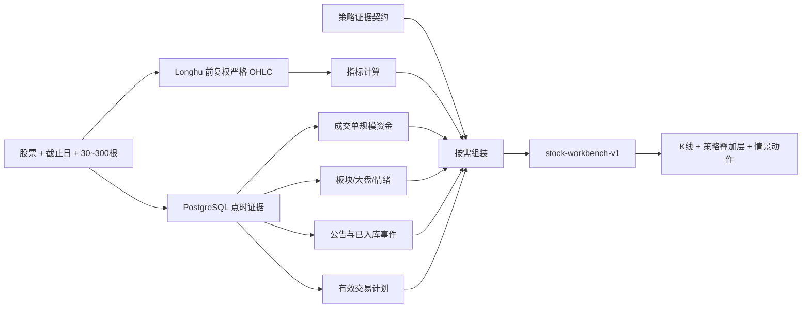
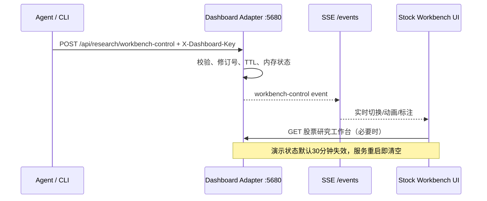

# 股票策略研究工作台

## 目标

工作台用于回答“同一只股票，在不同短线策略下应该看什么、忽略什么、下一交易日和下周分别如何验证”。它不是把所有字段堆在一个页面，也不会把技术参考位直接升级为买卖指令。

## 数据流



## 扩展契约

每个策略在 `quant-service/app/stock_workbench_contracts.py` 中声明：

- `required_panels`：缺失时必须降级并显式列出，不得默默换源或补猜。
- `optional_panels`：只在有意义时展示，缺失不能阻塞核心策略。
- `overlays`：该策略需要的 K 线叠加层。
- `metrics`：辅助图允许展示的指标及默认优先级；切换策略时自动切到首要指标，不沿用上一策略的图。
- `message_categories`：只显示与策略有关的消息类别。
- `volume_confirmation`：该策略自己的量能确认阈值，不作为所有策略的统一门槛。
- `horizon_sessions`：默认研究周期；后续策略可独立扩展。

新增策略时应先补契约与验收样本，再扩展情景生成器；不得在前端硬编码一个新的全量数据页面。

## 接口

正式只读接口：`GET /api/v1/stocks/{symbol}/workbench?lookback_days=120&as_of_date=2026-09-04`

同路径 POST 保留为兼容入口，但网页不使用它，读取研究数据不需要保存操作者 Key。

兼容 POST 请求：

```json
{
  "as_of_date": "2026-09-04",
  "lookback_days": 120
}
```

返回包括：

- 严格日线与周线序列；OHLC 缺失时拒绝该行，不用收盘价填充。
- MA、ATR、MACD、KDJ、Wilder RSI 与布林线。
- 策略清单、策略所需数据面板、当前读数与数据健康度。
- 下一交易日、下一周的三路径条件化情景及失效条件。
- 该策略相关的具体事件、来源、发生时间、可得时间和核验级别。
- 供应商成交单规模资金的 1/3/5/10 日统计。
- 当前有效交易计划；没有计划时只给研究触发器，不生成买入许可。

前端经适配器使用 `/api/research/stocks/{symbol}/workbench`。

## Agent 动态演示控制

讨论决策时，Agent 可以用 `scripts/stock-workbench-control.py` 动态改变工作台的**呈现状态**。该通道不写 PostgreSQL、不修改交易计划、不接触券商，更没有下单能力。



可控内容：

- 打开股票并设置 30–300 根历史窗口；
- 切换九种策略、日/周线、该策略允许的辅助指标和 K 线缩放区间；新增波动收缩突破、板块轮动初动、恐慌回收；
- 高亮下一交易日或下周的某条条件情景；
- 显示/隐藏 K 线、辅助指标、两组情景、消息、有效交易计划面板；
- 添加或移除价格线、事件点、日期/价格区间、临时说明；
- 显示带来源与截止时间的 Agent 讲解条。

常用命令（操作者 Key 默认从 `G:\StockPlatform\config\runtime.env` 读取且不会打印）：

```powershell
python G:\StockPlatform\current\scripts\stock-workbench-control.py present `
  --symbol 600487.SH --strategy event --timeframe weekly --metric volume `
  --zoom-start 25 --zoom-end 92 `
  --note-title '为什么关注这里' --note-body '事件只有在量价确认后才升级。' `
  --note-source '当前对话' --note-as-of '2026-09-05'

python G:\StockPlatform\current\scripts\stock-workbench-control.py annotate `
  --kind price_line --id pullback --label '回踩观察线' --price 50.20 `
  --source '策略情景' --as-of '2026-09-05'

python G:\StockPlatform\current\scripts\stock-workbench-control.py annotate `
  --kind region --id entry-zone --label '等待确认区' `
  --start-date 2026-08-25 --end-date 2026-09-05 --low 49.60 --high 51.20

python G:\StockPlatform\current\scripts\stock-workbench-control.py remove pullback
python G:\StockPlatform\current\scripts\stock-workbench-control.py clear
python G:\StockPlatform\current\scripts\stock-workbench-control.py reset
```

写命令统一走现有 `X-Dashboard-Key` 鉴权；只读状态可由 `GET /api/research/workbench-control` 检查。每个命令有递增 `revision`，页面忽略重复或倒序事件。默认 TTL 为 1800 秒，可在 30–86400 秒内调整。所有标注均显式标为临时演示，不得被报告、扫描器或交易计划读取为事实。

## 语义边界

- Longhu 资金字段是供应商按成交单规模归类的资金净额，不代表已识别的“主力”身份，不等同暗盘、Level-2 委托或撤单。
- 预测是可验证的条件情景，不是无样本支撑的主观概率。策略前向样本尚未达到校准门槛时返回 `not_calibrated`。
- 支撑、压力、突破和失效线是研究参考。只有未过期的人工/系统已审批交易计划才能给出具体仓位动作。
- 消息是点时证据。二手线索必须保留来源并标记需回查一手材料。

## 验收

1. 指标单测：严格 OHLC、Wilder RSI、周线聚合、历史响应字段顺序。
2. 契约单测：不同策略选择不同指标和消息，缺失必需证据时降级。
3. 前端单测：策略切换、消息过滤、图形标注和缩放状态。
4. 构建：Python 全套测试、Vue 类型检查、前端测试与生产构建。
5. 真实链路：通过已部署适配器请求一只股票，核对最新交易日、K 线数量、资金日期、九种策略、市场路由、独立风险层和无计划时的动作边界。
6. 动态控制：真实 CLI 命令经鉴权写入，SSE 页面在不刷新浏览器的情况下切换策略/周期并增删标注；重置后页面恢复人工控制。
