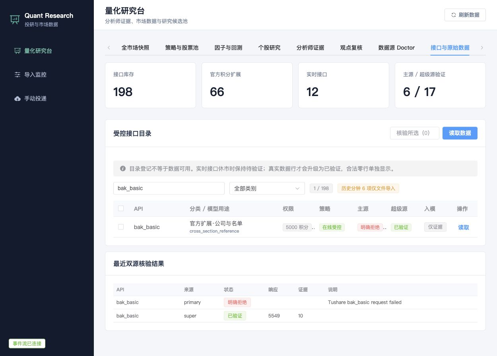

# Tushare 官方扩展与双源能力矩阵

审计日期：2026-08-09。该矩阵用于比较供应商书面合同、Tushare 官方目录、主兼容源和超级 SDK 路径源。任何 Token、代理凭据和供应商地址均不写入本文。

## 结论

- 平台当前登记 200 个接口名：供应商书面 109 项、既有竞价/实时增补 7 项、官方高价值与完整实时/离线分钟扩展 84 项。
- 200 是本平台的比较库存，不是对官方套餐数量的重新命名。Tushare 官方目录持续更新，积分接口、独立实时权限和历史分钟权限不能按一个数字等价换算。
- 已明确记录 66 个官方文档标注不高于 15,000 积分的扩展候选、13 个仅交易时段验证的实时接口和 6 个仅离线文件导入的历史分钟/逐笔接口。
- 目录登记只表示“允许受控核验”。真实非标题数据行才把某个 provider/API 升级为 `verified`；合法零行是 `empty`；明确的 `api not purchased` 是 `unsupported`；参数、协议或网络错误是 `failed`。
- 新扩展默认 raw-first，不直接进入推荐。只有完成字段口径、时点可用性、覆盖率和质量规则后，才可升级为标准化模型输入。

运行时目录：

```bash
curl http://127.0.0.1:5681/api/v1/providers/tushare/catalog
```

## 当前双源事实

2026-08-09 使用 `000636.SZ`、最近交易日和最多 10 行本地保存上限完成两批低频探针。

本轮结束时能力账本为：主源 6 项 `verified`、12 项明确 `unsupported`、180 项待验证；超级源 19 项 `verified`、1 项合法 `empty`、4 项 `failed`、174 项待验证。这是当前参数与日期下的证据快照，不是对未探测接口的结论。

| API | 主源 | 超级源 | 建模价值 |
|---|---|---|---|
| `bak_basic` | `api not purchased` | 真实返回，已验证 | 全市场截面与基础特征 |
| `stk_weekly_monthly` | `api not purchased` | 真实返回，已验证 | 周/月趋势与多周期因子 |
| `index_classify` | 真实返回，已验证 | 真实返回，已验证 | 申万行业分类 |
| `index_weekly` | `api not purchased` | 真实返回，已验证 | 指数中周期趋势 |
| `sw_daily` | `api not purchased` | 真实返回，已验证 | 行业行情和轮动 |
| `daily_info` | `api not purchased` | 真实返回，已验证 | 市场宽度与风险状态 |
| `fund_company` | `api not purchased` | 真实返回，已验证 | 基金管理人参考数据 |
| `fut_basic` | `api not purchased` | 真实返回，已验证 | 期货合约映射 |
| `cb_basic` | `api not purchased` | 真实返回，已验证 | 可转债基础与跨资产研究 |
| `stock_company` | `api not purchased` | 当前失败，待协议核验 | 发行人画像 |
| `stk_shock` | `api not purchased` | 当前路径 404 | 波动异常事件 |
| `dc_concept` | `api not purchased` | 当前路径 404 | 东财概念目录 |
| `st` | `api not purchased` | 当前路径 404 | 风险名单；已有 `stock_st` 供应商接口 |
| `index_weight` | 真实返回，已验证 | 合法零行 `empty` | 指数权重与基准暴露 |

主源的 109 项合同仍保留并可逐项受控读取；上述结果说明它不能代替超级源的官方扩展面。超级源在扩展数据上优先，失败时回退主源；已经标准化的日线、交易日历和风控数据仍按现有主源优先级执行。

## 实时接口

平台已登记并通过同一路由管理以下 13 项：

- 股票：`rt_k`、`rt_min`、`rt_min_daily`。两个分钟接口必填 `ts_code`、`freq`；它们按服务端交易日返回，不能传 `trade_date`。
- ETF：`rt_etf_k`、`rt_etf_min`、`rt_etf_min_daily`、`rt_etf_sz_iopv`。两个分钟接口必填 `ts_code`、`freq`。
- 指数/行业：`rt_idx_k`、`rt_idx_min`、`rt_idx_min_daily`、`rt_sw_k`。两个分钟接口必填 `ts_code`、`freq`。
- 期货：`rt_fut_min`、`rt_fut_min_daily`。两者必填 `ts_code`、`freq`；日累计回放可选 `date_str=YYYY-MM-DD`，不使用 `trade_date`。中金所 Tushare 合约后缀为 `.CFX`，例如 `IF2608.CFX`。

2026-08-09 为周末，双源 24 个探针全部返回本地 `skipped/declared`，没有调用上游，也没有写成 `unsupported`。n8n 活动工作流会在上海时间工作日 10:00 对股票、ETF、指数、申万行业和当月股指期货样本执行最小探针。只有交易时段真实返回后，对应 provider/API 才会变为 `verified`。

官方权限边界参考：[股票实时日线 `rt_k`](https://tushare.pro/document/2?doc_id=372)、[股票实时分钟 `rt_min`](https://tushare.pro/document/2?doc_id=374)、[当日历史分钟 `rt_min_daily`](https://tushare.pro/document/2?doc_id=457)、[ETF 实时分钟](https://tushare.pro/document/2?doc_id=416)、[指数实时分钟](https://tushare.pro/document/2?doc_id=420)。这些官方产品是独立实时权限；本项目对当前两个兼容供应商采用“交易时段合同声明 + 实际行验证”的证据标准。

## 历史分钟边界

`stk_mins`、`etf_mins`、`sw_mins`、`fut_mins`、`fut_tick`、`opt_mins` 在目录中可见，但在线入口会拒绝请求。供应商明确要求大体量历史分钟走网盘/持久卷，平台继续使用 CSV 流式导入、文件 SHA-256 幂等和批量写库。官方股票历史分钟本身也是单独权限，见 [`stk_mins`](https://tushare.pro/document/2?doc_id=370)。

## 建模接入顺序

1. `P0`：行业目录/成分、行业行情和资金流、指数权重、市场宽度、ST/停复牌/涨跌停，形成全市场横截面和风险门禁。
2. `P0`：股票/ETF/指数实时行情在实盘时段验证后，写入带 `effective_at`、`available_at` 和来源标签的盘中快照；未经覆盖率校验不参与决策。
3. `P1`：周月行情、异常波动、北向/南向、融券、筹码、资金流和专业因子，完成 point-in-time 规范化后进入因子实验。
4. `P1`：基金持仓、期货仓单/持仓、可转债和宏观数据用于市场状态、拥挤度与跨资产风险特征。
5. 每个特征必须通过字段口径、发布时间、复权、缺失率、截面覆盖、滞后和回测无前视检查，才能标记 `decision_eligible=true`。

## 操作接口

```bash
# 查看目录、官方权限元数据和双源事实
curl http://127.0.0.1:5681/api/v1/providers/tushare/catalog

# 最多 12 项、两个源、单标的、小行数能力核验
curl -X POST http://127.0.0.1:5681/api/v1/providers/tushare/audit \
  -H 'content-type: application/json' \
  -d '{"api_names":["index_weight","sw_daily"],"providers":["primary","super"],"symbol":"000636.SZ","max_rows":10}'

# 仅交易时段执行；休市返回 skipped，不调用上游
curl -X POST http://127.0.0.1:5681/api/v1/providers/realtime/probe \
  -H 'content-type: application/json' \
  -d '{"symbols":["000636.SZ"],"frequency":"1MIN"}'
```

前端 `接口与原始数据` 页与以上后端事实对齐：可按权限/策略查看，显示主源和超级源独立状态，最多选择 12 项执行双源核验，并展示真实行、有效空值、明确拒绝、调用失败和休市跳过。


